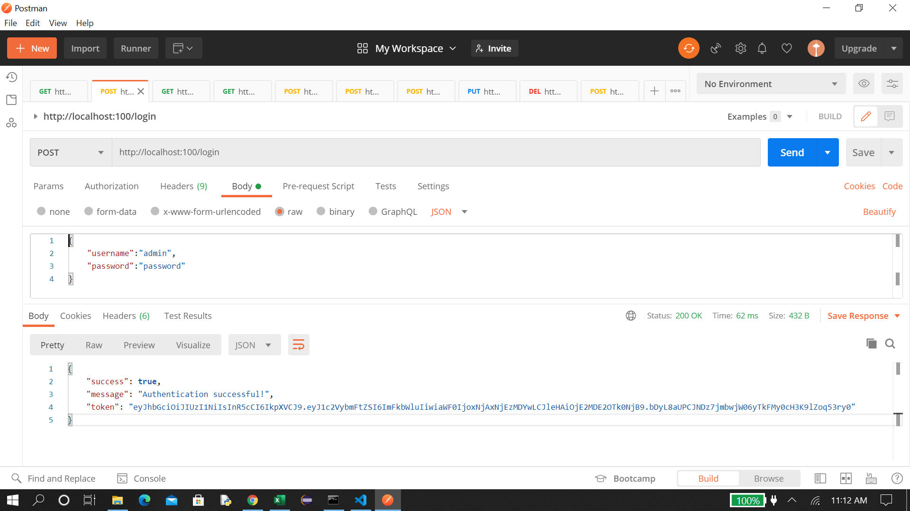
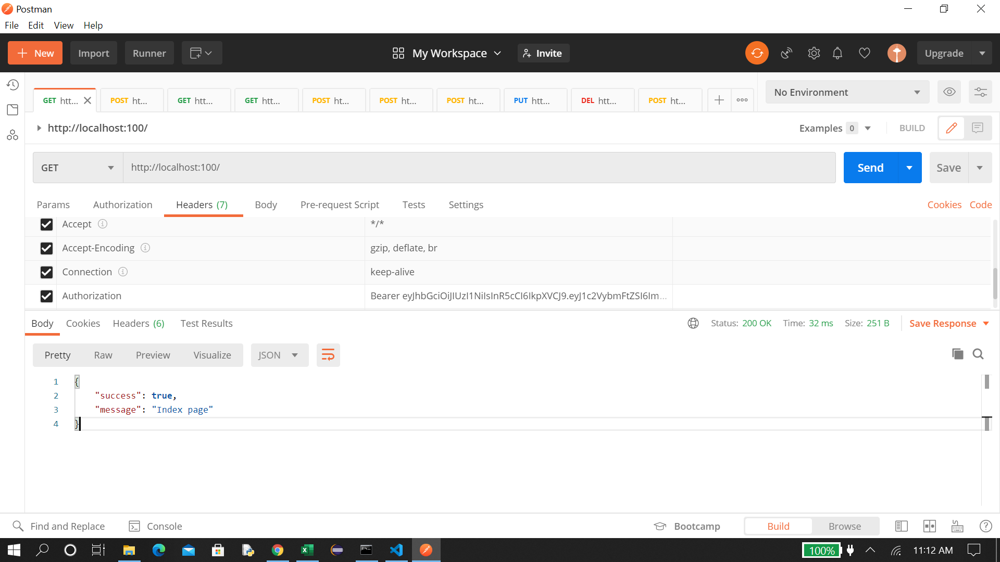
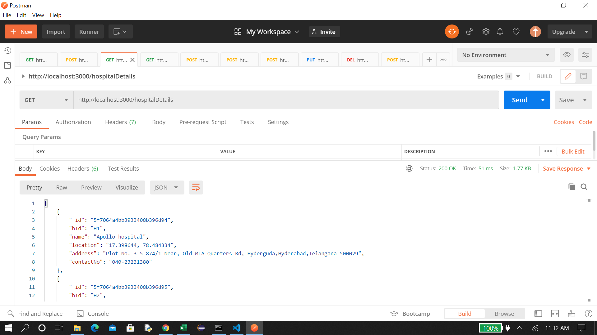
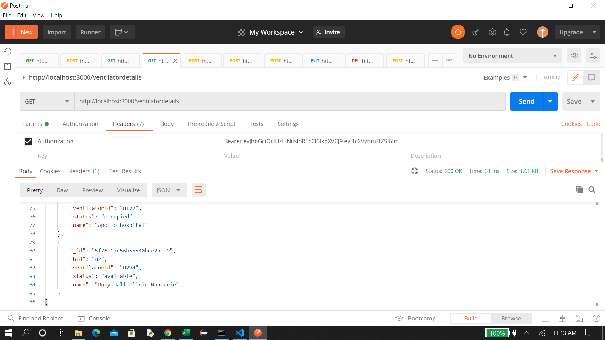
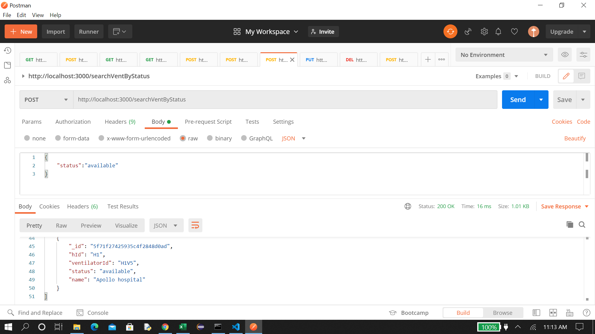
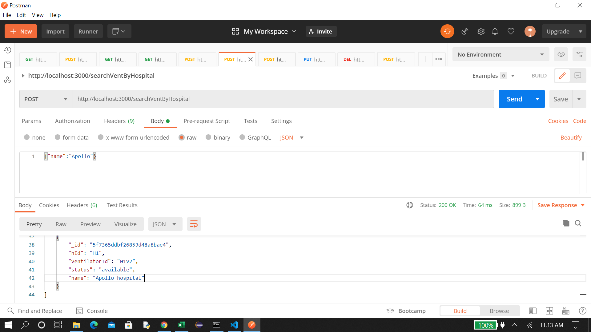
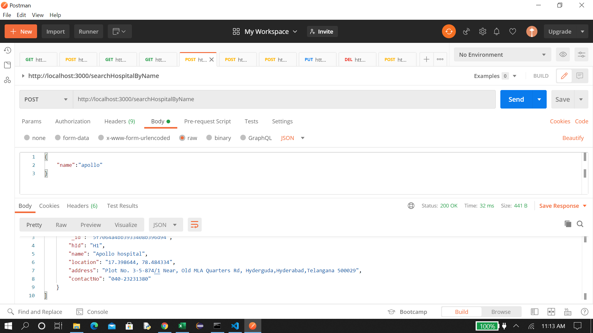
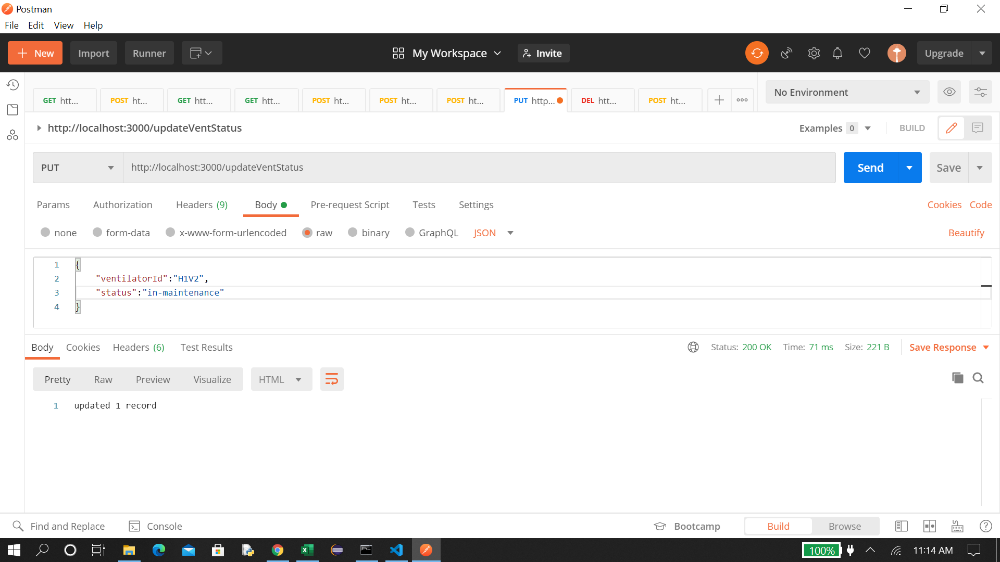
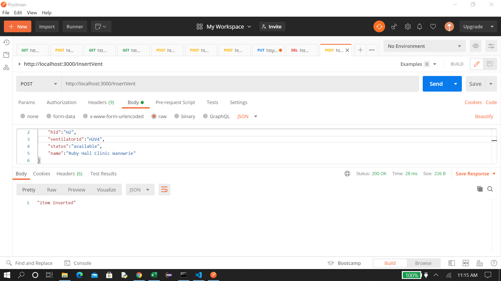
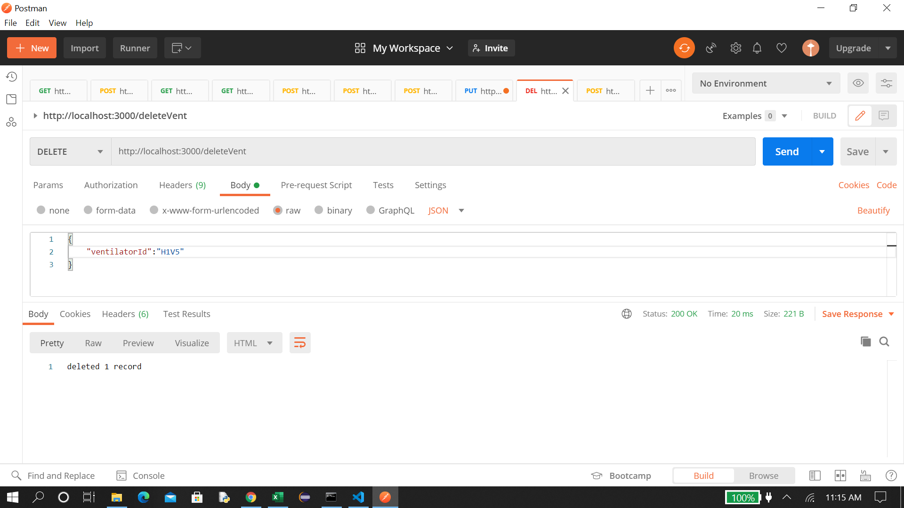

# modified by me second time
# Hospital Inventory RESTful API

This repository consists of a project based on CRUD API using Express JS, Node JS, and MongoDB for Hospital Inventory.

## Problem Statement
Inventory management of critical health care infrastructure including real time usage tracking has become inevitable following the current pandemic. 

This project aims at building an inventory tracking system for ventilators that allows authorized hospital users to input details of the available inventory and tag it as “occupied”, “available” and “in-maintenance”. The three status can also be updated using a secure API for real time usage metrics. The application should have the ability to also add any ventilator to a specific hospital and search ventilators which are available.

## Implementation and project details

### MongoDB Database
The database "hospitalInventory" consists of two collections:
1. "hospital"
2. "ventilator"  

The db.txt file contains the database schema and the entries made into the database.

### API

1. [Login and get token for authentication](#Login-and-get-token-for-authentication)
2. [Verify Authorization](#Verify-Authorization)
3. [Read Hospital Details](#Read-Hospital-Details)
4. [Read Ventilator Details](#Read-Ventilator-Details)
5. [Search Ventilators by status](#Search-Ventilators-by-status)
6. [Search Ventilators by Hospital name](#Search-Ventilators-by-Hospital-name)
7. [Search Hospital by Hospital Name](#Search-Hospital-by-Hospital-Name)
8. [Update Ventilator Details](#Update-Ventilator-Details)
9. [Add Ventilator](#Add-Ventilator)
10. [Delete Ventilator by VentilatorId](#Delete-Ventilator-by-VentilatorId)

### POSTMAN 
I have used POSTMAN for testing and posting details of API

### Login to get token for authentication

### Verify Authorization

### Read Hospital Details

### Read Ventilator Details

### Search Ventilators by status

### Search Ventilators by Hospital name

### Search Hospital by Hospital Name

### Update Ventilator Details

### Add Ventilator

### Delete Ventilator by VentilatorId

